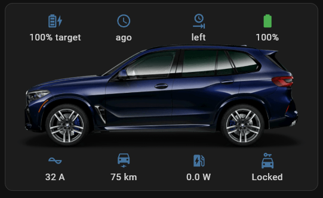
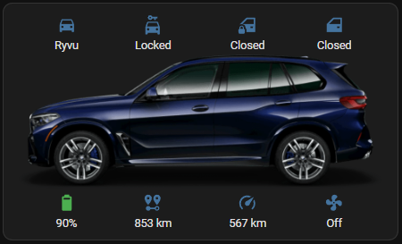

# Home Assistant bmw x5 PHEV card

The [Home Assistant BMW Connected Drive](https://www.home-assistant.io/integrations/bmw_connected_drive/) integration can be used to extract data from the car. That will give you about 30 integration entries (entities) in your Home Assistant, but it does not come with any visualization.

These are some Home Assistant dashboard cards that can display the BMW X5 information.

## charging card

Charging cable connected:

No charging cable connected:

## minimal card

## Features

Car information that can be visualised:

- Charging session overview
	- Plugged In | Unplugged | Charging
	- Charging status
	- Charging time elapsed | remaining
- Vehicle state
	- Remaining range
	- Mileage
	- Locked | Unlocked
	- Door/Window Overview
	- Home | Away
	- Airconditioning

# Installation

1. Requires [Home Assistant BMW Connected Drive](https://www.home-assistant.io/integrations/bmw_connected_drive/), and some [extra Home Assistant components](#necessary-home-assistant-components) if not yet available.
2. Add the extra sensors (see `sensors.yml`)
3. Copy the contents of `bmw-x5-charging-card.yml` or `bmw-x5-minimal-card.yml` into a lovelace card.
4. Modify the entity names based on your setup.

## Necessary Home Assistant components

You will need to install the following components from HACS if you want these cards to work:

- [Card-mod to apply CSS Styles](https://github.com/thomasloven/lovelace-card-mod)
- [Animated Bar card](https://github.com/custom-cards/bar-card)
- [Button Card](https://github.com/custom-cards/button-card)

## Entity Naming
The entity names used in this card's repository are setup to assume a brand new install of the Home Assistant BMW Connected Drive integration.

For an X5 xDrive50e, all entities will be named with the prefix `x5_xdrive50e_` (that's also the example in this repo). Adapt as needed for your setup.

## Sensors

### Templated sensors

The `bmw-x5-charging-card.yml` card uses the [Home Assistant Picture Elements Card](https://www.home-assistant.io/dashboards/picture-elements) as a base to get everything rendered well on all devices, but that card is quite limited in templating options, and thus the following templated sensors have to be added on top of the ones made available by the BMW Connected Drive integration (see [`sensors.yml`](cards/sensors.yml)):

- `charging_time_remaining` (& `charging_time_remaining_formatted`)
- `charging_time_elapsed` (& `charging_time_elapsed_formatted`)

_______________________________________________________________________

# Resources

## BMW API

- [Home Assistant BMW Connected Drive](https://www.home-assistant.io/integrations/bmw_connected_drive/)
- [Bimmer Connected](https://bimmer-connected.readthedocs.io/en/latest/index.html)
- [Traffic interception Flutter apps](https://blog.nviso.eu/2022/08/18/intercept-flutter-traffic-on-ios-and-android-http-https-dio-pinning/)

## Home Assistant dashboards - inspiration - credits

other:

- https://blog.sanghviharshit.com/home-assistant-dashboard-tesla/
